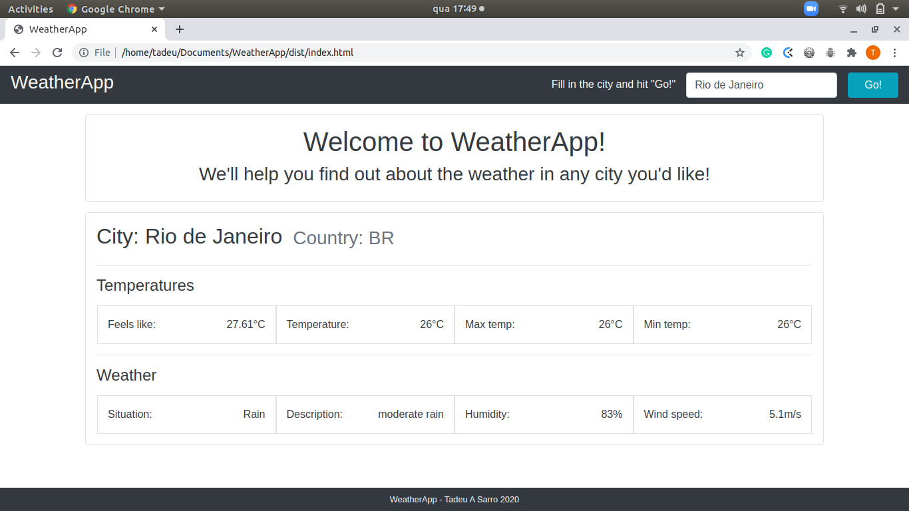

# WeatherApp

#### Welcome to my WeatherApp. The purpose here is to create an application that allows the user to search about the weather conditions, in any city of the world!

#### Features
- Input the desired city into a search;
- Info about temperatures, weather conditions, wind speed and humidity.

#### Screenshot

#### Livedemo
- [Githack](https://rawcdn.githack.com/tadeuasarro/WeatherApp/d1fc4101590279ac3c07d5752773a15a7b4b6f0a/dist/index.html)

## Getting started
- run `git clone https://github.com/tadeuasarro/weatherapp.git`;
- run `npm install` at the root of the project;
- run `npx webpack` at the root of the project;
- go to `../dist`;
- open `index.html` with you favorite browser.

## Authors
👤 This is me:

- [Tadeu A Sarro](https://tadeuasarro.web.app)

## Contributing

Contributions, issues and feature requests are welcome!

Feel free to check the [issues page](https://github.com/tadeuasarro/weatherapp/issues)

## Show your support

Give a star if you like this project!

## 📝 License

This project is MIT licensed.
